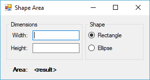

## VinylUI - Framework for F# Desktop Applications

VinylUI is a framework for building Windows Forms (and soon WPF) applications that embraces functional paradigms and MVC-like separation of responsibilites.

Code for a window or form is split into the following parts:

- **Model type**: A record type that represents the entire logical state of the window.

- **Events type**: A discriminated union that represents all possible user actions and events of the window.

- **Binder**: Function that creates bindings between the UI components and the Model.

- **Events function**: Function that maps events of the UI components to the logical Events.

- **Dispatcher**: Function that maps logical events to event handlers. An event handler takes a Model instance and returns a new Model instance in response.

VinylUI does not require sub-classing or interface inheritance. Using it is as simple as calling a function that takes the three functions described above. This allows you to structure your functions how you see fit, whether you prefer to organize them into modules or use a more object-oriented approach with classes and dependency injection.

### Immutable models?

It may seem strange to use an immutable model type in a stateful application, but working with immutable types has several benefits. One of those benefits is that your code becomes easier to reason about. Event handlers, where the application logic resides, will be stateless and will always return the same output for a given input. Tests against them will be easy to write.

How can properties of an immutable model be bound? The framework compares "before" and "after" model instances to detect what parts of the model were changed by the event handler and triggers the corresponding bindings to the user interface.

### Show me some code!

Let's build a simple app. We'll ask the user to enter the width and height of a shape and select whether it is a rectangle or an ellipse. The app will display the area of the shape.

First, let's model the state of the form:

    type Shape = Rectangle | Ellipse

    type Model = {
        Width: decimal option
        Height: decimal option
        Shape: Shape
        Area: Result<decimal, string>
    }

Nice and clean. Now what events does our form have? The user can either change the size or change the shape.

    type Events =
        | DimensionChanged
        | ShapeChanged of Shape

Now we can write a binder function that hooks up the form controls to our model properties.

    let binder (form: IShapeAreaForm) model =
        let parseDecimal s =
            match Decimal.TryParse s with
            | true, d -> Some d
            | false, _ -> None

        let areaDisplay = function
            | Ok (area: decimal) -> string area
            | Error msg -> sprintf "Error - %s" msg

        [ Bind.view(<@ form.WidthInput.Text @>).toModelOneWay(<@ model.Width @>, parseDecimal)
          Bind.view(<@ form.HeightInput.Text @>).toModelOneWay(<@ model.Height @>, parseDecimal)
          Bind.model(<@ model.Area @>).toViewOneWay(<@ form.AreaDisplay.Text @>, areaDisplay)
        ]

This defines a couple of helper functions: one to parse a string into a `decimal option` and another to convert the Area `Result` into a string for display on the label.

The binder then returns a list of bindings using the Bind API. A binding starts at one end, view or model, specifying a property to bind with a quotation, and binds to a property on the other end, again specified with a quotation. Here we create 3 one-way bindings, all specifying conversions with our helper functions (which are necessary since our property types don't match).

Next, we connect form control events to our events:

    let events (form: IShapeAreaForm) =
        [ form.WidthInput.Validated |> Observable.mapTo DimensionChanged
          form.HeightInput.Validated |> Observable.mapTo DimensionChanged
          form.RectangleButton.CheckedChanged
            |> Observable.filter (fun _ -> form.RectangleButton.Checked)
            |> Observable.mapTo (ShapeChanged Rectangle)
          form.EllipseButton.CheckedChanged
            |> Observable.filter (fun _ -> form.EllipseButton.Checked)
            |> Observable.mapTo (ShapeChanged Ellipse)
        ]

We return a list of Observables of our event type. As you can see, we can use `Observable` functions to manipulate the events from the form and convert them to our events.

One last part to build: the dispatcher and event handlers. This is where our logic goes. Our `dispatcher` function will simply delegate to our handler functions.

    let dispatcher = function
        | DimensionChanged -> Sync updateArea
        | ShapeChanged s -> Sync (shapeChanged s)

The event handlers are synchronous and simply return an updated model based on the current one.

Since we bound the width and height inputs to our model, all we need to do when a size dimension is changed is re-calculate the area `Result` based on the width, height, and shape then return the model with the updated Area. We do this with a pattern match.

    let updateArea model =
        let res =
            match model.Width, model.Height, model.Shape with
            | Some w, Some h, Rectangle -> Ok (w * h)
            | Some w, Some h, Ellipse -> Ok ((w * h / 4m) * (decimal Math.PI))
            | None, Some _, _ -> Error "Missing width"
            | Some _, None, _ -> Error "Missing height"
            | None, None, _ -> Error "Missing width and height"
        { model with Area = res }

When the shape changes, we update the Shape property on the model then update the Area.

    let shapeChanged newShape model =
        { model with Shape = newShape }
        |> updateArea

Finally, we tie it all together with a call to `Framework.start` with an initial model.

    let start (form: IShapeAreaForm) =
        let model = {
            Width = None
            Height = None
            Shape = Rectangle
            Area = Error "Missing width and height"
        }
        Framework.start binder events dispatcher form model

... and in Program.cs we kick things off by calling VinylUI's `Run` extension on Form that accepts a "start" function:

    new ShapeAreaForm().Run(FormLogic.start);

Hopefully, this simple example gives you a decent idea of how modeling your application and separating concerns this way can make your code easy to understand and maintain. It keeps Windows Forms and visual concerns out of your business logic. The Model and Events explicitly define what is on the form and how it can be interacted with.

You can find this (and soon other) full working examples in the [examples](examples/) folder.
