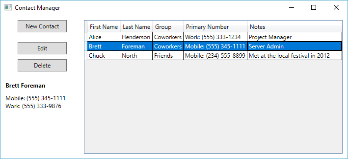

# Examples

- [ShapeArea](ShapeArea/) is a very simple example using Windows Forms on .NET Framework 4.6. It consists of a single
form that takes a width, length and shape type to compute an area.

  

- [ContactsManager](ContactsManager/) is a more sophisticated example using WPF on .NET Core 3 to build an editable
phone book. It has two windows, demonstrates display and editing of records using text boxes, combo boxes and data
grids. It also has an example of text box validation.

  

  

